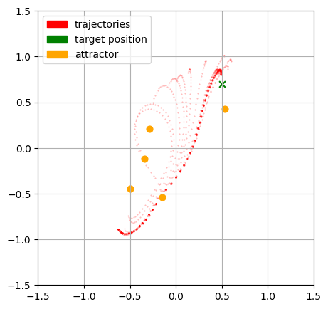

# Exploration of Differentiable Physics

I created this repo to understand and apply differentiable physics in the context of numerical solvers for newtons equation of motion and the navier stokes equations. 

The project is grouped into different notebooks. 

- ``preliminaries.ipynb`` A quick recap of different nabla operators and their numerical applications using finite differences.
- ``I_verlet.ipynb`` A manual implementation of reverse mode differentiation of an ODE integration scheme. Applied to optimize for initial conditions.
- ``II_autodiff.ipynb`` The same thing but using autodiff as provided by JAX and more complex forces.
- ``III_thrust_vector.ipynb`` Optimizing the thrust vector control of a simplified rocket model. Both for liquid, and the more interesting case of solid state rocket engines.
- ``IV_hyperbolic.ipynb`` Derivation Advection and Lax Wendroff schemes, differentiable mac cormack for solving for the initial condition of the burgers equation.
- ``V_waves.ipynb`` Differentiable mac cormack in 2D for the wave equation.
- ``VI_stokes_incompressible.ipynb`` Forward implemenation compressible NS equations using Mac Cormack. Attempt at inverse case, unsuccessfull.
- ``VII_stokes_inc_man.ipynb`` Attempt to intuitively derivae a solver for NS equations, only partially finished.
- ```VIII_stokes_inc_vort_stream.ipynb```Incompressible NS equations using the vortex stream method, only partially finished.

## Solving for initial conditions with a verlet integrator



In this setup a differentibale version of the verlet integration method was used to find an optimal initial position and velocity which moves an object true a force field created by several attractors to a target position.
You can see the evolution of the trajectory over the course of the gradient descent algorithm until it conveges to a near optimal solution.

The solution is not unique as its based on improving an initial guess, if the initial guess is choosen differently the solution will be different.
