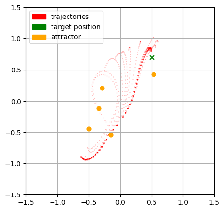

# Exploration of Differentiable Physics

I created this repo to understand and apply differentiable physics in the context of numerical solvers for newtons equation of motion and the navier stokes equations. 

In this setup a differentibale version of the verlet integration method was used to find a trajectory which moves an object true a force field created by several attractors. 
You can see the evolution of the trajectory over the course of the gradient descent algorithm until it conveges to a near optimal solution.

